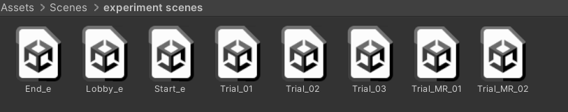
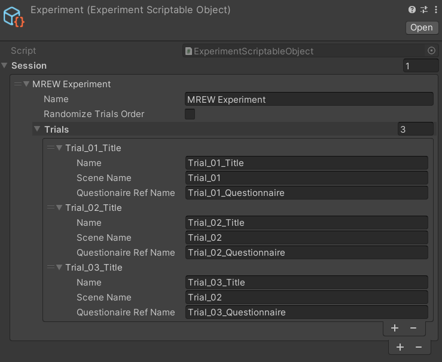
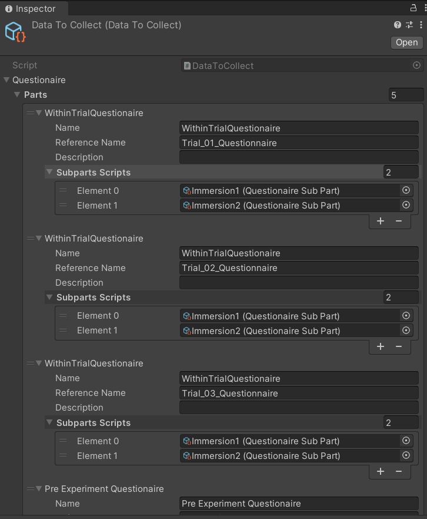

MR-RIEW

- Unity Version 2021.2.7f1
- Tested HMDs: Oculus Quest, Oculus Quest 2  (VR, MR)

- Install
  - Clone https://github.com/CrowdVRLab/MR-RIEW.git
  - Use the scenes in Scenes/experiment scenes
  

     
  

- Template  
  Experiment Workflow Template:
  use Start_e as entry point to create your experiment wokflow. Template is made by the following scenes:
        Start_e: initial scenes
        Trial_01: trial scene
        Trial_02: trial scene
        Trial_03: trial scene
        Lobby_e: scene used between trial scene to display a questionnaire
        End_e: ending scene

How it works

Trial scene can be a VR scene (Trial_XX) or a MR scene (Trial_MR_XX)
Trial Scene contain the scenario and the logic of your experiment, up to the experimenter.

The infrastructure is based on Scriptable Objects that triggers events to enter the trials and to exit from them, 
loading the Lobby scene where In-VR or eventually In-MR-RIEWquestionnaires are proposed to the user.
        
Scriptable Object relevant for the experiment, and that has to be changed according to experimenter requirements are:

   

Prefabs/UIPrefabs/Experiment : contains the list of the trials, the scenes associated and the name of the questionnaires group to associate at each trial.
                               This file is linked in ExperimentManager, an object that orchestrate the experiment that lives in the Start_e scene
                               

   

                           
Prefabs/UIPrefabs/DataToCollect: Contains the questionnaires in the form of a list of questionnaires group. The number of item in the list needs to batch the number of scenes used in Experiment Scriptable Object. Each Questionnaire Group can contains Questionnaire Scriptable Objects. In this way Questionnaire Scriptable Object can be used 
to compose a full questionnaire. In this scriptable object also Pre Experiment Questionnaire and Post Experiment Questionnaire can be defined (need to match the Reference name in Experiment Manager game object) DataToCollect is linked in UIManager. 
                                 
Prefabs/UIPrefabs/UI: contains the association between UI element and prefab of such graphic user interface. (You need to change if you want to change style or graphic elements of the user interface for the Questionnaires)

